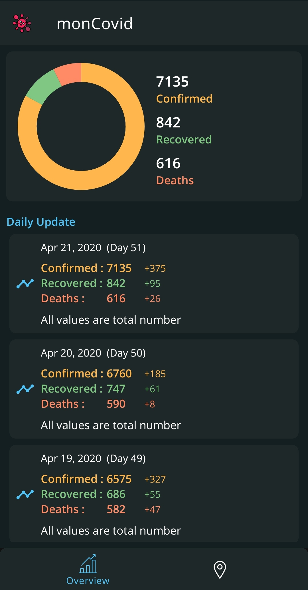
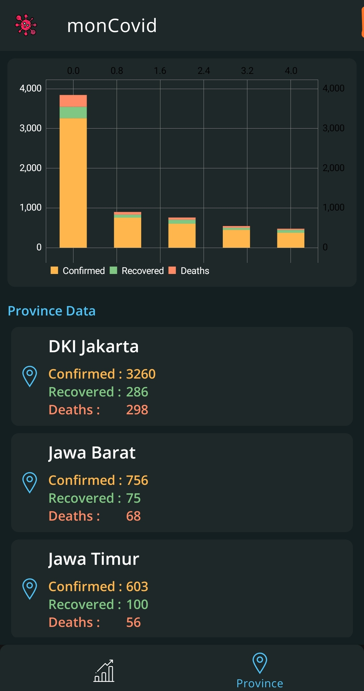
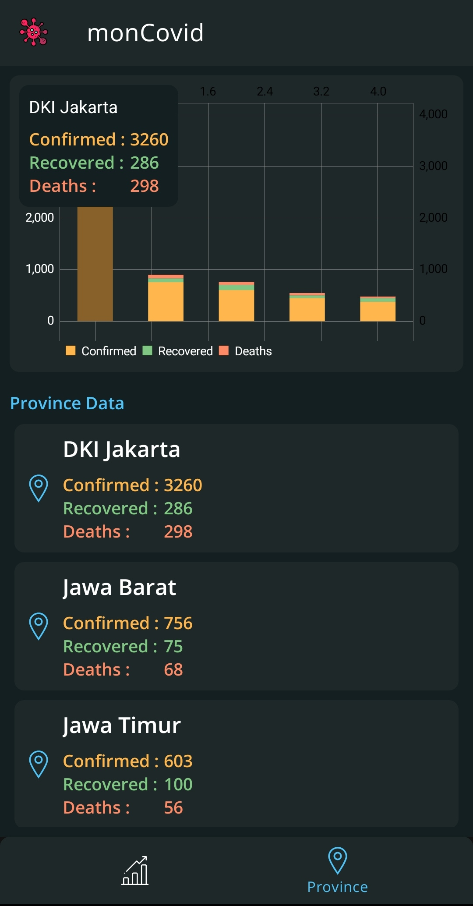

# monCovid
Simple Monitoring COVID-19 Apps in Indonesia

- MVVM Pattern
- ViewModel & LiveData
- Navigation Component
- Rx
- Room
- Koin
- WorkManager
- [MPAndroid Chart](https://github.com/PhilJay/MPAndroidChart)

